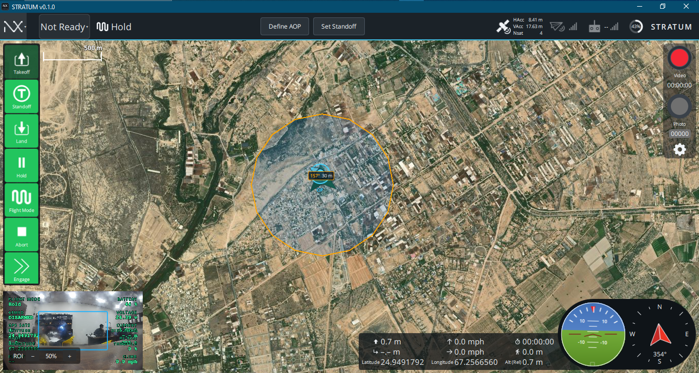
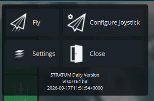
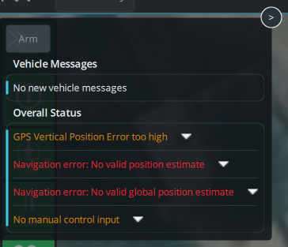
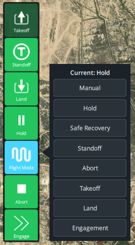
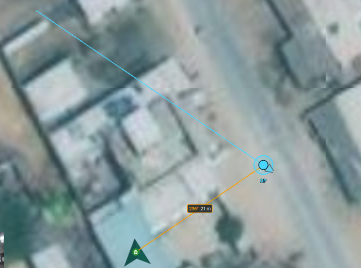
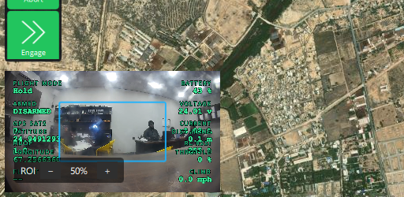

# STRATUM Ground Station — User Guide

This guide walks you through everything you see on the STRATUM screen while flying:
the top ribbon, the command buttons on the left, the map, the video window, the
right-hand camera controls, and the flight instruments along the bottom. Each
section pairs a screenshot with a plain-English explanation of what every button
and readout does.

> Screenshots in this guide live in the `UI/` folder next to this document.

---

## 1. The main screen at a glance

STRATUM's fly view is divided into six regions:

| Region | What it does |
|---|---|
| **Top ribbon** | Vehicle status, current flight mode, mission shortcuts, GPS accuracy, radio links, battery. |
| **Left command strip** (green buttons) | Every action you take on the aircraft — takeoff, standoff, land, hold, mode selection, abort, engage. |
| **Map** (main area) | Live satellite map with the vehicle, the ground station, the trail, the AOP (Area of Persistence), and the standoff ring. |
| **Right camera dock** | Record video, take photos, open camera settings. |
| **Bottom-left video pane** | Small live camera feed with telemetry overlay and ROI zoom slider. |
| **Bottom instruments** | Telemetry row, artificial horizon (attitude), and compass. |

The rest of this guide zooms into each region.

---

## 2. Top ribbon — vehicle status and quick actions

Reading the ribbon left to right:

### 2.1 NX menu (top-left corner)

Clicking the **NX** logo opens the STRATUM main menu:

- **Fly** — returns you to the flight screen you see in this guide.
- **Configure Joystick** — pairs and calibrates a USB/BT joystick or transmitter.
- **Settings** — application settings: general options, comm links, offline maps,
  MAVLink, console, mock link, etc.
- **Close** — closes the STRATUM application.

The build version and timestamp are shown underneath (e.g. `STRATUM Daily Version
v0.0.0 64 bit …`).

### 2.2 Arm chip — "Not Ready" / "Ready" / "Armed" / "Flying"

The chip immediately after the NX icon is the **arm status chip**. It shows the
current aircraft state in one word and doubles as the entry point into the
preflight drawer.

- **Not Ready** — one or more preflight checks have failed. Click the chip to
  see the details (Section 2.3).
- **Ready** — all preflight checks pass. Click the chip to arm the vehicle.
- **Armed** — motors are spinning / ready to spin. Click to disarm on the
  ground.
- **Flying** — the aircraft is in the air.

### 2.3 Status drawer (opens when you click the arm chip)

The drawer is split into three parts:

1. **Arm** button at the top — arms the aircraft when all checks pass.
2. **Vehicle Messages** — the last messages sent by the flight controller
   (calibration prompts, warnings, informational text).
3. **Overall Status** — a list of every preflight check the aircraft runs. Any
   failing check appears in red and blocks arming. Common examples:
   - *GPS Vertical Position Error too high* — wait for better GPS lock.
   - *Navigation error: No valid position estimate* — the EKF has no valid
     position; move to open sky.
   - *No manual control input* — RC transmitter is off or not paired.

Each row has a chevron you can click to see more detail on that particular
check.

### 2.4 Current flight mode display

The line **`⋀⋁ Hold`** (icon + name) shows the mode the flight controller is
running **right now**. This is a read-only indicator — to *change* the mode use
the Flight Mode button on the left strip (Section 3.5). On VTOL airframes a
second tag appears next to the mode name showing FW / MC / Transition.

### 2.5 Mission shortcuts — Define AOP and Set Standoff

Two ribbon buttons let you draw the STRATUM operating geometry directly on the
map:

- **Define AOP** — Area of Persistence. Click, then drag on the map to place the
  point the aircraft should orbit or watch. This is the orange circle you see in
  the main screenshot.
- **Set Standoff** — sets the standoff radius (how far the aircraft stays from
  the AOP). Click, then drag on the map to size the ring.

### 2.6 GPS accuracy readout

Three small numbers on the right of the center block:

- **HAcc** — horizontal position accuracy in metres. Smaller is better;
  ≤ 1 m indicates a fixed RTK / good GNSS lock.
- **VAcc** — vertical position accuracy in metres.
- **Nsat** — number of GNSS satellites in the solution.

### 2.7 Link and battery indicators

To the right of GPS, four small icons summarise connectivity and power:

- **Telemetry radio** (antenna icon with bars) — signal quality of the datalink
  to the aircraft. Grey bars mean no telemetry.
- **RC controller** (transmitter icon with bars) — signal quality reported by
  the RC receiver. Grey bars mean no RC.
- **Battery** (round gauge with %) — percentage remaining on the primary
  aircraft battery. Colour changes as the pack drains (green → amber → red).
- **STRATUM wordmark** — brand mark on the right edge; no click action.

---

## 3. Left command strip — the pilot's action buttons

The green strip on the left of the map is the primary way you command the
aircraft. Buttons are stacked in the order you typically use them.

### 3.1 Takeoff

Sends a takeoff command. A slider confirmation appears so you can slide to
commit. The aircraft climbs to the takeoff altitude configured in vehicle
parameters and then holds position.

### 3.2 Standoff

Commands the aircraft to fly to the currently defined standoff position (the
ring you drew with **Set Standoff** on the top ribbon) and hold there. Use this
to reposition the aircraft after retasking the AOP or when returning from a
manual dash.

### 3.3 Land

Commands a land at the current position. Confirm on the slider that appears.
The aircraft descends and disarms once it detects touchdown.

### 3.4 Hold

Commands the aircraft to stop and hover in place immediately — the fastest way
to freeze the mission if you need a moment to think. Multirotors will loiter at
the current lat/lon/alt; fixed-wing airframes will orbit.

### 3.5 Flight Mode

Opens the mode picker (see Section 3.5.1). Use this button whenever you need to
switch the flight controller between modes such as *Manual*, *Hold*,
*Standoff*, *Engagement*, etc.

#### 3.5.1 Flight Mode picker

The picker lists every mode STRATUM allows you to command:

- **Current: Hold** — the header shows the mode the aircraft is in right now.
- **Manual** — full stick-authority piloting; safety limits are minimal.
- **Hold** — hover in place at the current position.
- **Safe Recovery** — return to the recovery point using the safest path
  configured by the operator.
- **Standoff** — fly to the standoff ring and orbit at the configured radius.
- **Abort** — break off the current task cleanly (identical to the **Abort**
  strip button, offered here for convenience).
- **Takeoff** — command a takeoff from the ground.
- **Land** — command a landing at the current position.
- **Engagement** — commit the aircraft to the engagement profile you configured
  (used with the **Engage** strip button below).

Tapping any row asks you to confirm the mode change before it is sent to the
aircraft.

### 3.6 Abort

Clears the current tasking and puts the aircraft into a safe holding behaviour
immediately. Use this if a mission is going wrong and you need to disengage.

### 3.7 Engage

Commits the aircraft to the engagement profile. This is a destructive /
irreversible command — STRATUM will present a red confirmation slider so you
cannot trigger it accidentally.

---

## 4. Map view — situational awareness

The main satellite map shows every geometry that matters to the mission:

- **Orange circle** — the **AOP** (Area of Persistence) you defined from the
  ribbon. The aircraft's job is anchored to this point.
- **Cyan circle** inside the AOP with an arrow — the **vehicle**. The arrow
  shows the aircraft heading. The label next to it shows range and bearing to
  another reference (`157° 30 m` in the screenshot).
- **Green diamond** — an optional waypoint or reference target on the map.
- **500 m scale bar** in the top-left of the map — current zoom scale.

### 4.1 GCS icon, heading, and trail

STRATUM draws your **ground station** on the map so you always know where you
are relative to the aircraft:

- **Blue circle with a chevron** — the GCS position. The chevron points in the
  direction the GCS is currently facing (heading). If the GNSS receiver does
  not report a heading (stationary receivers usually don't), the chevron falls
  back to your direction of travel or the bearing to the aircraft and is drawn
  slightly transparent to indicate it is estimated.
- **`GCS` label** — printed under the marker so it is unambiguous.
- **Blue dotted line** — the GCS **trail**: where the GCS has been over the
  last few seconds. Useful when moving with the aircraft on foot or in a
  vehicle.
- **Orange line with `236° 21 m`** — the **bearing and distance from the GCS
  to the vehicle**. This is your quickest "where is the aircraft relative to
  me?" cue.

The GCS position comes from the NMEA GNSS receiver you configured under
**Settings → Comm Links** (port and baud rate). If nothing is drawn, check that
the NMEA port is opened by STRATUM (and not held by another application like
UPrecise).

---

## 5. Video window (bottom-left)

The bottom-left corner shows the live camera feed with a compact telemetry
overlay burned in. Click the pane to swap it with the map (picture-in-picture
style).

Overlay fields (green text):

- **FLIGHT MODE** — current mode (e.g. `Hold`).
- **ARMED / DISARMED** — arm state of the vehicle.
- **BATTERY** — remaining battery percentage.
- **VOLTAGE** — pack voltage.
- **GPS SATS** — number of satellites the *aircraft* sees.
- **CURRENT** — battery current draw in amps.
- **LATITUDE / LONGITUDE** — aircraft position.
- **HEADING** — aircraft magnetic heading.
- **ALTITUDE** — altitude above the takeoff point.
- **THROTTLE** — throttle percentage.
- **AIRSPEED / GROUND SPEED** — knots or mph, depending on units settings.

At the bottom of the pane:

- **ROI  −  50 %  +** — Region of Interest zoom. The `−` and `+` buttons zoom
  the digital ROI in the camera image; the percentage shows the current zoom
  level. This is a digital zoom — it does not command a physical gimbal
  focal-length change.

---

## 6. Right-hand camera dock

On the right edge of the map (visible in the main screenshot) STRATUM shows
camera capture controls:

- **Red circle — "Video"** — starts and stops video recording. The counter
  underneath (e.g. `00:00:00`) shows the current clip length. The circle turns
  into a stop icon while recording.
- **Grey circle — "Photo"** — captures a still photo. The counter below
  (e.g. `00000`) shows how many photos you've taken this session.
- **Gear icon — Camera settings** — opens camera options such as source
  selection, resolution, exposure, and storage location.

---

## 7. Bottom instruments — telemetry and attitude

Along the bottom of the fly view you see three groups:

### 7.1 Telemetry row (center)

A compact grid of numbers with icons:

- **↑ 0.7 m** — climb / descent rate.
- **↳ − . − m** — distance to next waypoint (dashes when unset).
- **Latitude / Longitude** — aircraft geodetic position.
- **↑ 0.0 mph** — vertical speed in your units.
- **→ 0.0 mph** — horizontal ground speed.
- **⏱ 00:00:00** — elapsed flight time since arming.
- **↥ 0.0 m** — altitude AGL / above takeoff.
- **Alt (Rel) 0.7 m** — altitude relative to the takeoff point.

The exact set of fields is configurable in **Settings → General → Instrument
Panel**.

### 7.2 Attitude indicator (artificial horizon)

The round instrument with the blue / green split and the pitch ladder shows the
aircraft's **roll and pitch** in real time. The centre wings represent the
aircraft; the horizon tilts and slides behind them.

### 7.3 Compass

The compass rose on the far bottom-right shows:

- **N / E / S / W** cardinal points.
- **Red arrow** — aircraft heading.
- **Numeric heading readout** underneath (e.g. `354° S`).

---

## 8. A typical mission — putting it all together

1. **Power up** the aircraft and the ground station. Wait for the arm chip to
   turn from **Not Ready** to **Ready**. If it stays red, click the chip and
   resolve every red item in the **Overall Status** list.
2. **Draw your geometry** with **Define AOP** and **Set Standoff** on the
   ribbon.
3. **Takeoff** using the left-strip **Takeoff** button. Confirm on the slider.
4. **Standoff** — after takeoff the aircraft holds. Press **Standoff** to send
   it to the ring, or leave it in **Hold** while you verify camera and links.
5. **Change modes** with **Flight Mode** whenever you need something other than
   Standoff / Hold (for example, **Manual** for hands-on flying).
6. **Record video / take photos** with the right-hand dock as needed.
7. **Engage** only when you have explicitly cleared the mission — the confirm
   slider is there specifically to prevent accidents.
8. **Land** or **Abort** to end the sortie. Watch the status drawer for any
   post-flight messages before shutting down.

---

## 9. Troubleshooting quick reference

| Symptom | First thing to check |
|---|---|
| Arm chip stays **Not Ready** | Click the chip, resolve each red row in the Overall Status list. |
| No GCS marker on the map | **Settings → Comm Links**: NMEA port + baud correct; no other app (e.g. UPrecise) is holding the port. |
| GCS chevron looks faded / stuck | Your GNSS receiver isn't reporting heading; STRATUM is estimating from motion or bearing. Move a few metres and it will settle. |
| Flight Mode picker opens but rows look empty | Rebuild after the latest STRATUM update — this was a known QML scoping issue and is fixed in current builds. |
| Video pane is black | Check the camera source and format under the gear icon on the right dock. |
| Radio / RC bars are grey | Telemetry link or RC receiver isn't heartbeating; check power, antennas, and pairing. |

---

*STRATUM is built on the QGroundControl platform; the fly view is customised for
the STRATUM mission workflow (AOP, Standoff, Engagement). If you're familiar
with QGroundControl, everything under **Settings** works the same way.*
